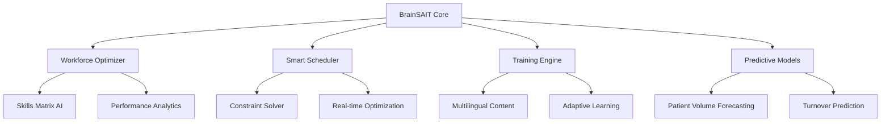

{
  `path`: `~/BrainSAIT-Automation/README.md`,
  `content`: `# 🧠 BrainSAIT Workforce AI
## AI-Powered Healthcare Workforce Optimization for Saudi Arabia

[](https://opensource.org/licenses/MIT)
[](https://www.python.org/downloads/)
[](https://www.docker.com/)
[](https://www.cloudflare.com/)

### 🎯 Mission
Address the critical workforce shortage in Saudi healthcare through AI-powered optimization, automated scheduling, multilingual training, and predictive staffing models.

### 📊 Evidence-Based Impact
Based on validated success stories from:
- **King Faisal Specialist Hospital & Research Centre (KFSHRC)**: Reduced bed waiting times from 32 to 6 hours
- **Ministry of National Guard Health Affairs (MNGHA)**: ML-powered no-show prediction models
- **Saudi Data & AI Authority (SDAIA)**: National AI strategy implementation

## 🏗️ Architecture



## 🚀 Features

### 🤖 AI-Powered Workforce Optimization
- Real-time skills matrix analysis
- Competency gap detection
- Cross-training recommendations
- Performance correlation modeling

### 📅 Automated Scheduling System
- Saudi Labor Law compliance
- Multi-objective optimization
- Emergency callback protocols
- Staff preference integration

### 🎓 Multilingual Training Modules
- Arabic/English content generation
- AI-powered content processing
- Adaptive learning paths
- SCFHS certification tracking

### 📊 Predictive Staffing Models
- Patient volume forecasting
- Acuity prediction
- Turnover risk assessment
- Seasonal adjustment models

## 🛠️ Tech Stack

**Backend:**
- FastAPI (Python 3.11+)
- PostgreSQL + Redis
- XGBoost, Prophet, LightGBM
- Whisper ASR, Coqui TTS

**Frontend:**
- Next.js 14 with TypeScript
- Tailwind CSS (RTL Support)
- Recharts for analytics
- Arabic/English i18n

**Infrastructure:**
- Docker + Docker Compose
- Cloudflare Tunnels
- GitHub Actions CI/CD
- Prometheus + Grafana

## 📦 Quick Start

### Prerequisites
```bash
- Docker & Docker Compose
- Python 3.11+
- Node.js 18+
- Git
```

### 1. Clone & Setup
```bash
git clone https://github.com/fadil369/BrainSAIT-Workforce-AI.git
cd BrainSAIT-Workforce-AI
cp .env.example .env
```

### 2. Environment Configuration
```bash
# Database
POSTGRES_DB=brainsait_workforce
POSTGRES_USER=brainsait
POSTGRES_PASSWORD=your_secure_password

# Redis
REDIS_URL=redis://localhost:6379

# AI Models
OPENAI_API_KEY=your_openai_key
WHISPER_MODEL_PATH=./models/whisper
COQUI_MODEL_PATH=./models/coqui

# Hospital Integration
HOSPITAL_HIMS_URL=https://your-hospital-system.com/api
SAUDI_MOH_API_KEY=your_moh_api_key
```

### 3. Deploy with Docker
```bash
docker-compose up -d
```

### 4. Access Applications
- **API Documentation**: http://localhost:8000/docs
- **Frontend Dashboard**: http://localhost:3000
- **Grafana Monitoring**: http://localhost:3001

## 🏥 Integration Examples

### Hospital Information Management Systems (HIMS)
```python
from brainsait import WorkforceOptimizer

optimizer = WorkforceOptimizer()
schedule = optimizer.generate_optimal_schedule(
    department=\"Emergency\",
    timeframe=\"weekly\",
    constraints={
        \"saudi_labor_law\": True,
        \"minimum_staff_ratio\": 1.5,
        \"skills_requirements\": [\"BLS\", \"ACLS\"]
    }
)
```

### Saudi MOH Compliance
```python
from brainsait import ComplianceValidator

validator = ComplianceValidator()
is_compliant = validator.check_saudi_regulations(
    schedule=schedule,
    staff_licenses=staff_data,
    overtime_rules=True
)
```

## 🎯 Roadmap

### Phase 1: Core MVP ✅
- [x] Workforce optimization engine
- [x] Basic scheduling algorithms
- [x] Database schema design
- [x] Docker containerization

### Phase 2: AI Enhancement 🔄
- [ ] Predictive models training
- [ ] Multilingual content pipeline
- [ ] Real-time analytics dashboard
- [ ] Hospital system integrations

### Phase 3: Scale & Deploy 📈
- [ ] Cloudflare Workers deployment
- [ ] Multi-tenant architecture
- [ ] Advanced monitoring
- [ ] Saudi healthcare pilot programs

## 🤝 Contributing

We welcome contributions! Please see our [Contributing Guide](./CONTRIBUTING.md) for details.

### Development Setup
```bash
# Backend development
cd backend
python -m venv venv
source venv/bin/activate
pip install -r requirements.txt
uvicorn main:app --reload

# Frontend development
cd frontend
npm install
npm run dev
```

## 📄 License

This project is licensed under the MIT License - see the [LICENSE](LICENSE) file for details.

## 🌟 Acknowledgments

- **Dr. Fadil** - Founder & Lead Developer [@fadil369](https://github.com/fadil369)
- **Saudi Data & AI Authority (SDAIA)** - National AI Strategy guidance
- **KFSHRC & MNGHA** - Real-world validation insights

## 📞 Contact & Support

- **Website**: [brainsait.com](https://brainsait.com)
- **Email**: fadil@brainsait.com
- **LinkedIn**: [linkedin.com/in/fadil369](https://linkedin.com/in/fadil369)
- **Twitter**: [@brainsait369](https://twitter.com/brainsait369)

---

**Built with ❤️ for Saudi Healthcare Innovation | Vision 2030 Aligned**
`
}